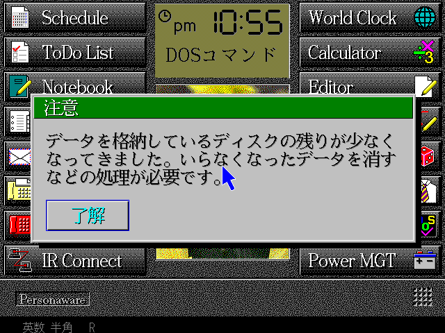
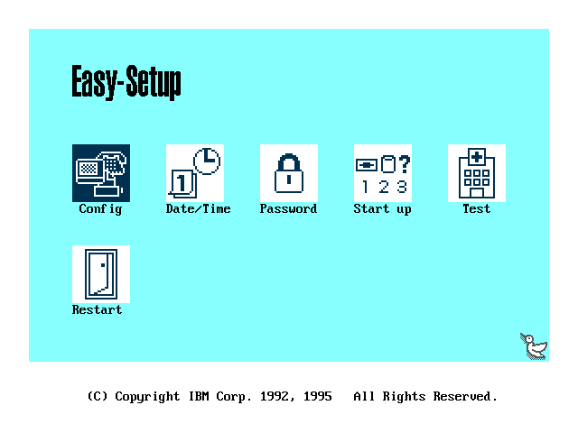

# PC110-QEMU

Run the IBM Palm Top PC 110's software on QEMU using the real machine ROMs:
**IBM Personaware** (the Japanese pen GUI) boots with genuine kanji rendering —
now including straight off the **real 256 KiB PC110 BIOS**, all the way to the
pen desktop.




This repository is a small set of QEMU device models plus build/run tooling. It
does **not** contain any IBM ROMs or disk images — you supply your own legally
obtained dumps (see [`roms/`](roms/README.md) and [`disks/`](disks/README.md)).

## What works

- **Authentic power-on on the genuine BIOS** (`scripts/run-realbios.sh`) — the
  real 256 KiB ROM POSTs with its own on-screen POST codes ending in
  "Starting PC DOS...", a power-on beep, and a "Press F1 for Easy-Setup" prompt.
  Press F1 (promptly) to enter Easy-Setup; otherwise it boots DOS, runs the RIOS
  driver stack, hands off to VGA mode 12h, and paints the full pen launcher with
  kanji from the font ROM. See [Booting the real BIOS](#booting-the-real-bios).
- **Personaware on SeaBIOS** boots to the same full pen-driven launcher
  (Schedule, ToDo, Notebook, Address, E-Mail, FAX, Telephone, IR Connect, World
  Clock, Calculator, Editor, Draw Memo, Game, Personal, DOS, Power MGT) with
  sharp kanji from the PC110 font ROM. The disk is a 4 MB FAT12 image (matching
  the real unit's internal storage) so it boots straight to a clean launcher — a
  disk with 512-byte clusters trips a bogus "low disk space" dialog regardless of
  how much is free (see [`disks/`](disks/README.md)).
- **Easy-Setup** (the real graphical BIOS setup: Config / Date-Time / Password /
  Start up / Test / Restart) runs and renders from the genuine BIOS ROM — reached
  by F1 during the real-BIOS POST, directly via `run-easysetup-realbios.sh`, or
  under SeaBIOS. Its menu and panels are navigable and Exit/Restart returns to the
  normal boot.
- **PC-speaker audio** — the PC110's sound (PIT channel 2 gated by port `0x61`)
  is wired to a host backend so beeps are audible. See
  [Audio and CPU speed](#audio-and-cpu-speed).
- **Authentic ~33 MHz CPU** — the guest is paced to the real 33 MHz 486 clock via
  QEMU `-icount` (instead of running as fast as the host). See
  [Audio and CPU speed](#audio-and-cpu-speed).

## How it works

The PC110's own 256 KB BIOS cannot POST on QEMU's i440fx (it drives a custom
VLSI/SCAMP chipset and a Chips & Technologies flat-panel VGA), so this project
takes two complementary approaches:

- **Personaware** boots via SeaBIOS on QEMU's fast, correct x86 core. The one
  piece it needs from the real machine — the hardware **kanji font ROM** — is
  emulated by the `pc110-fontrom` device (an 8 KB banked window at `0xDE000`,
  bank-select at port `0x1160`), so the DOS/V font subsystem initializes and the
  GUI renders Japanese text.
- **Easy-Setup** is a self-contained graphical program embedded (LZW-compressed)
  in the BIOS ROM. It is extracted, loaded to `0x50000`, and entered at
  `5000:0000` exactly as the real BIOS does. It draws with standard VGA
  (mode 12h), which QEMU renders directly — no PC110 POST required.

### Device models (`qemu/hw-misc/`)

| Device | I/O | Purpose |
| --- | --- | --- |
| `pc110-fontrom` | `0x1160`–`0x1163`, mem `0xDE000` | Banked 1 MiB kanji font ROM window |
| `pc110-chipset` | `0x4F`, `0x74/76`, `0xEC/ED`, `0x15E8`, `0x35EA`, `0x80`–`0x8F` | VLSI/SCAMP + power-MCU shim, optional full-ROM shadow overlay (for experiments booting the real BIOS) |

> Easy-Setup needs **no custom device** — it runs on stock QEMU/SeaBIOS. Which
> screen it shows depends on the **boot device type**: booted as a floppy it
> shows the config menu; booted as a hard disk it shows its built-in
> hardware-diagnostics page. (An earlier `pc110-setupcfg` device that tried to
> drive the menu via config registers was a dead end and has been removed.) A
> minimal, dependency-free variant of just the Easy-Setup path lives in the
> companion repo **[pc110-easysetup-seabios](https://github.com/ahmadexp/pc110-easysetup-seabios)**,
> including USB/CompactFlash boot media for real hardware (e.g. Vortex86 boards).

### Easy-Setup exit path (`boot/`)

The `setupboot-floppy.asm` loader boots Easy-Setup from a floppy and makes
"Exit"/"Restart" return to normal Personaware mode three ways: a far-return exit
stub, a hooked `INT 19h` vector, and QEMU's `-boot once=a` (so a hardware reset
falls through to the hard disk).

## Requirements

- QEMU 11.0.2 build deps (a C toolchain, `meson`, `ninja`, `glib`, `pixman`).
- `nasm` (to assemble the Easy-Setup boot loader).
- `python3`.
- macOS on Apple Silicon is the primary tested host; `scripts/build-qemu.sh`
  pins the `/opt/homebrew` toolchain there. Linux should work with the default
  configure flags.

## Setup

```sh
# 1. Put your ROM dumps in place  (see roms/README.md)
#    roms/pc110_bios.bin        (256 KiB system BIOS)
#    roms/pc110-fontrom.bin     (1 MiB kanji font ROM)

# 2. Build QEMU with the PC110 devices
./scripts/build-qemu.sh

# 3. Prepare disks  (see disks/README.md)
#    Personaware (from a raw partition dump):
python3 tools/make-disk.py your-pc110-dump.img disks/Personaware-disk.img
#    Easy-Setup boot floppy (unpacked from the BIOS ROM):
./boot/build-floppy.sh

# 4. Run
./scripts/run-realbios.sh            # REAL BIOS: authentic POST + beep + F1 -> Personaware or Easy-Setup
./scripts/run-easysetup-realbios.sh  # REAL BIOS: straight into Easy-Setup
./scripts/run-personaware.sh         # Personaware GUI (SeaBIOS)
./scripts/run-easysetup.sh           # Easy-Setup via SeaBIOS (Exit -> Personaware)
```

All run scripts pace the CPU to ~33 MHz and route PC-speaker audio to the host
(see [Audio and CPU speed](#audio-and-cpu-speed)).

The QEMU window opens at 2x the guest resolution (the PC110 screen is tiny on a
high-DPI/Retina Mac); set `QEMU_COCOA_SCALE=N` to change it (1 = native). It is
still freely resizable — drag a corner, or press Ctrl+Cmd+F for full screen.
Quit with Ctrl+Cmd+Q.

## Booting the real BIOS

`scripts/run-realbios.sh` boots the genuine 256 KiB PC110 BIOS on QEMU instead
of SeaBIOS, and **reaches the full Personaware pen desktop** — POST, DOS, the
RIOS driver stack, the mode-12h video handoff, and the launcher, all driven by
the real ROM (screenshot at the top of this README).

- **POST completes** — memory sizing, chipset self-tests, timer/refresh
  calibration, the KBC warm-reset state machine.
- **DOS boots** — a software `INT 19h`/`INT 13h` service loads the boot sector
  and services disk I/O from the image; the PC-DOS kernel and the `CONFIG.SYS`
  driver stack (HIMEM, the RIOS `$FONT`/`$DISP`/`$IAS` drivers, `POWER.EXE`,
  `IBMMKKV`) plus `AUTOEXEC.BAT` (`KEYB`, `MOUSE`, `INKDRV`, `PW.BAT`) run.
- **Personaware renders** — `MET.COM` switches to VGA mode 12h (640×480×16,
  which QEMU's stock `-vga std` draws directly) and paints the launcher with
  kanji from the font ROM.

### The two pieces that make it work

1. **Loose protected mode** (`qemu/patches/05-seg-helper-loose-pm.patch`). The
   PC110 BIOS + drivers run long stretches in *unreal mode* — `CR0.PE=1` while
   loading real-mode-style segment values (`F000`, VGA selectors, …). A faithful
   x86 core (QEMU) `#GP`s on every such segment op, producing an endless
   general-protection fault storm. Post-boot, under `PC110POST`, QEMU's PM
   segment helpers (`load_seg`, far `jmp`/`call`/`ret`/`iret`, interrupt
   delivery) instead do **base-only resolution with no type/privilege/present
   checks** — using a descriptor's real base when its access byte is non-zero and
   `selector<<4` otherwise, and delivering interrupts same-privilege so frames
   stay balanced. This mirrors the reference emulator **PC110-EMU**'s
   `pc110_segment_base_for_selector`. Pre-boot POST is untouched (faithful PM).
2. **No EMM386.** EMM386's V86/paging monitor assumes *faithful* PM and conflicts
   irreconcilably with the driver's unreal-mode segment usage. Removing it from
   `CONFIG.SYS` (see [`disks/`](disks/README.md)) leaves the driver's loose PM as
   the only regime, and the boot runs clean to the desktop. (EMM386 support is
   future work — it would need a full V86-aware loose-PM model.)

The `pc110-chipset` device models the VL82C420's config windows against the
live-hardware register maps in the **Open-Source-PC110** project's
[`Discovery/Chipset`](https://github.com/ahmadexp/Open-Source-PC110/tree/main/Discovery/Chipset):
the SCAMP window (`0x74/0x76`), the **block2** POST/init window (`0x24/0x25`,
seeded from the live dump), and the clock-stop / config-lock latches
(`0x22/0x23`, `0x302`, `0x704`).

How it works (`qemu/target-i386/pc110post.c` + `qemu/patches/`):

- A TCG-level completer hooked into the CPU exec loop (enabled by the
  `PC110POST` env var) short-circuits POST wait-loops that never converge under
  emulation, seeds the warm-boot contract around the KBC CPU-reset, and services
  `INT 19h`/`INT 13h` from `$PC110BOOT`.
- The KBC `0xFE` reset is a synchronous **CPU-only** reset (RAM preserved)
  instead of QEMU's async full-machine reset, matching the 286-era
  protected-mode-exit idiom the BIOS/driver rely on.
- `pc110-chipset` supplies the ROM/shadow map (C0000-DFFFF ROM, E0000-EFFFF a
  DOS UMB that becomes writable after boot, F0000-FFFFF shadow RAM) and the
  VLSI/SCAMP + CMOS register banks seeded from a real-hardware dump.

Completer env vars: `PC110POST=1` enables the completer (reads `PC110BOOT`);
`PC110POSTUI=1` turns on the [realistic boot](#realistic-boot-post-beep-and-f1);
`PC110SETUP=1` forces the [F1-at-POST Easy-Setup](#easy-setup-via-f1-on-the-real-bios)
outcome (with `PC110SETUPIMG` = the extracted program, `PC110SETUPHD=1` to select
its diagnostics page); `PC110NOPALFIX=1` disables the Easy-Setup palette fix;
`PC110RSTLOG=1` gives verbose reset/driver tracing; `PC110HEARTBEAT=1` samples where
non-BIOS code executes; `PC110RESUME=1` re-enables the legacy A6E4 reset-resume shim
(superseded by loose PM). The run scripts also read the host-side `PC110_AUDIODEV`
and `PC110_ICOUNT` (see [Audio and CPU speed](#audio-and-cpu-speed)).

### Realistic boot (POST, beep, and F1)

`scripts/run-realbios.sh` is the authentic power-on sequence (env `PC110POSTUI=1`,
on by default in that script; `PC110POSTUI=0` boots straight to Personaware):

- **Genuine POST on screen.** The BIOS POST writes its progress with `INT 10h`
  teletype (`F000:542C`), but the PC110 leaves the main VGA in an uninitialised
  mode (it uses its C&T flat panel and front LCD), so under `-vga std` that output
  was invisible. At the first teletype the completer injects a genuine
  `INT 10h AX=0003` (via the real VGA BIOS, returning through a sentinel) so 80×25
  text renders — showing the real POST checkpoint codes and `Starting PC DOS...`.
- **Power-on beep** — a short PC-speaker tone (PIT ch2).
- **"Press F1 for Easy-Setup"** prompt. A key pressed while the POST is on screen
  is seen at the boot decision (`F000:52BD`) and enters Easy-Setup; otherwise
  Personaware boots. The window is short (~1 s): the emulated POST reaches its
  boot decision quickly and can't be paused there (a halted CPU that early has no
  timer IRQ to wake it, and any busy wait either starves host input under the BQL
  or TB-chains), so press F1 promptly. A real keypress is detected via a small
  PS/2 hook (`qemu/patches/06-ps2-pc110-keywatch.patch`).

### Easy-Setup via F1 on the real BIOS

`scripts/run-easysetup-realbios.sh` takes the **F1-at-POST** branch into
Easy-Setup on the real BIOS and shows the graphical config menu (Config /
Date-Time / Password / Start up / Test / Restart):



Enabled by `PC110SETUP=1`:

- At the boot decision point (`F000:52BD`) it takes the ROM's F1 outcome
  (`F000:3273` → `F000:3391` = Easy-Setup) instead of booting the disk. Because
  the ROM's *live* LZW decompress+enter stalls under emulation, it loads the
  **extracted** Easy-Setup program (`PC110SETUPIMG`, unpacked by
  `boot/build-floppy.sh`) to `0x50000` and enters it at the real entry
  `5000:0000`.
- Easy-Setup reads the **POST error log** via `INT 15h AH=21h AL=00h` and shows
  its `⊘ERROR` diagnostics screen whenever the log is non-empty; the emulated
  POST logs spurious entries, so `PC110SETUP` (and the `PC110POSTUI` F1 path)
  force that service to return an **empty** log (`BH=0`, CF clear) — so Easy-Setup
  opens the config menu. (This is why the SeaBIOS-shim Easy-Setup path —
  `run-easysetup.sh` — exists too: it's the same extracted program run without the
  real BIOS.)
- **Palette fix.** Easy-Setup picks its menu colours from a colour-*theme*
  selector; because we enter the extracted program directly at `5000:0000` (past
  the ROM's pre-entry init), its first draws came up "blue-ish" and only corrected
  to the intended rose after navigating. The loader aliases theme block 0 to the
  correct block (copying the 9 rose bytes at image `0xBCFF` over `0xBCF6`) so every
  draw is right from the start. Disable with `PC110NOPALFIX=1`.

## Audio and CPU speed

Both are wired into every run script and are overridable by env var.

- **Audio.** The PC110's sound is the PC speaker (PIT channel 2 gated by port
  `0x61`), the same path the reference emulator models. QEMU's built-in PC speaker
  is connected to a host audio backend with
  `-audiodev "$PC110_AUDIODEV",id=snd0 -machine pcspk-audiodev=snd0`.
  `PC110_AUDIODEV` defaults to `coreaudio` (macOS); set it to `pa` / `pipewire` /
  `alsa` on other hosts, or `none` to mute. Idle is silent; beeps (POST, Easy-Setup
  keypresses) play.
- **CPU speed (~33 MHz).** By default TCG runs the guest as fast as the host, so
  the boot and UI run far faster than a real PC110. `-icount shift=5` paces each
  instruction to 32 ns of virtual time throttled to real time — ≈ 31 MHz, the
  nearest power-of-two step to the real 33 MHz 486 (QEMU `-icount` only takes
  power-of-two shifts). Override with `PC110_ICOUNT` (e.g. `shift=4` ≈ 62 MHz,
  `shift=6` ≈ 16 MHz), or set it empty to run at full host speed.

## Status / limitations

- **Personaware** (both the real-BIOS and SeaBIOS paths) and **Easy-Setup** all
  reach their GUIs, with PC-speaker audio and ~33 MHz CPU pacing on by default.
- The real-BIOS **POST + "Press F1" window** works but is short (~1 s), because the
  emulated boot reaches its decision point quickly and can't be held there — press
  F1 promptly (see [Realistic boot](#realistic-boot-post-beep-and-f1)).
- The **real-BIOS** path reaches the Personaware desktop with a `CONFIG.SYS` that
  does not load EMM386 (see [Booting the real BIOS](#booting-the-real-bios)).
  Booting the stock EMM386 configuration on the real BIOS is future work (needs a
  V86-aware loose-PM model).
- Easy-Setup on the **real BIOS** (`run-easysetup-realbios.sh`) is fully
  navigable: the main menu and every panel open and render from the genuine ROM
  — Config (Memory / Keyboard / Serial / Parallel / SystemBoard / Initialize,
  and its nested settings dialogs, e.g. Keyboard's Typematic / Pointing OK/Cancel
  dialog), Date-Time (year/time spin editor), Start up (boot-device order), and
  Test (hardware-diagnostics menu). On the **SeaBIOS-shim** path
  (`run-easysetup.sh`) the same program runs but a few in-menu *actions* call
  PC110 BIOS services SeaBIOS lacks, so they may not fully function; entering and
  exiting back to Personaware work on both paths.

## Credits

Chipset register behavior, the font-ROM window protocol, and the Easy-Setup LZW
container format were determined with reference to the **PC110-EMU** project
(github.com/ahmadexp/PC110-EMU), a dedicated PC110 emulator.
