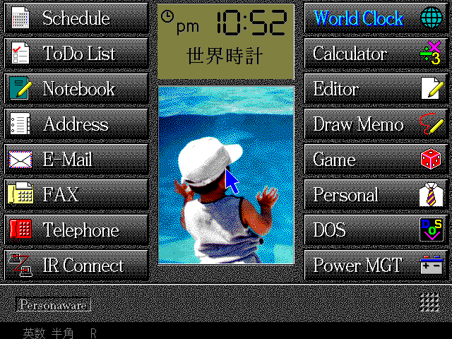

# PC110-QEMU

Run the IBM Palm Top PC 110's software on QEMU using the real machine ROMs:
**IBM Personaware** (the Japanese pen GUI) boots with genuine kanji rendering,
and the real PC110 **Easy-Setup** BIOS screen runs under SeaBIOS.




This repository is a small set of QEMU device models plus build/run tooling. It
does **not** contain any IBM ROMs or disk images — you supply your own legally
obtained dumps (see [`roms/`](roms/README.md) and [`disks/`](disks/README.md)).

## What works

- **Personaware** boots to its full pen-driven launcher (Schedule, ToDo,
  Notebook, Address, E-Mail, FAX, Telephone, IR Connect, World Clock,
  Calculator, Editor, Draw Memo, Game, Personal, DOS, Power MGT) with sharp
  kanji drawn straight from the PC110 font ROM. The disk is a 4 MB FAT12 image
  (matching the real unit's internal storage) so Personaware boots straight to a
  clean launcher — a disk with 512-byte clusters trips a bogus "low disk space"
  dialog regardless of how much is free (see [`disks/`](disks/README.md)).
- **Easy-Setup** (the real graphical F1 BIOS setup: Config / Date-Time /
  Password / Start up / Test / Restart) runs under SeaBIOS and renders from the
  genuine BIOS ROM. Exiting it returns to normal Personaware mode.

## How it works

The PC110's own 256 KB BIOS cannot POST on QEMU's i440fx (it drives a custom
VLSI/SCAMP chipset and a Chips & Technologies flat-panel VGA), so this project
takes two complementary approaches:

- **Personaware** boots via SeaBIOS on QEMU's fast, correct x86 core. The one
  piece it needs from the real machine — the hardware **kanji font ROM** — is
  emulated by the `pc110-fontrom` device (an 8 KB banked window at `0xDE000`,
  bank-select at port `0x1160`), so the DOS/V font subsystem initializes and the
  GUI renders Japanese text.
- **Easy-Setup** is a self-contained graphical program embedded (LZW-compressed)
  in the BIOS ROM. It is extracted, loaded to `0x50000`, and entered at
  `5000:0000` exactly as the real BIOS does. It draws with standard VGA
  (mode 12h), which QEMU renders directly — no PC110 POST required.

### Device models (`qemu/hw-misc/`)

| Device | I/O | Purpose |
| --- | --- | --- |
| `pc110-fontrom` | `0x1160`–`0x1163`, mem `0xDE000` | Banked 1 MiB kanji font ROM window |
| `pc110-chipset` | `0x4F`, `0x74/76`, `0xEC/ED`, `0x15E8`, `0x35EA`, `0x80`–`0x8F` | VLSI/SCAMP + power-MCU shim, optional full-ROM shadow overlay (for experiments booting the real BIOS) |

> Easy-Setup needs **no custom device** — it runs on stock QEMU/SeaBIOS. Which
> screen it shows depends on the **boot device type**: booted as a floppy it
> shows the config menu; booted as a hard disk it shows its built-in
> hardware-diagnostics page. (An earlier `pc110-setupcfg` device that tried to
> drive the menu via config registers was a dead end and has been removed.) A
> minimal, dependency-free variant of just the Easy-Setup path lives in the
> companion repo **[pc110-easysetup-seabios](https://github.com/ahmadexp/pc110-easysetup-seabios)**,
> including USB/CompactFlash boot media for real hardware (e.g. Vortex86 boards).

### Easy-Setup exit path (`boot/`)

The `setupboot-floppy.asm` loader boots Easy-Setup from a floppy and makes
"Exit"/"Restart" return to normal Personaware mode three ways: a far-return exit
stub, a hooked `INT 19h` vector, and QEMU's `-boot once=a` (so a hardware reset
falls through to the hard disk).

## Requirements

- QEMU 11.0.2 build deps (a C toolchain, `meson`, `ninja`, `glib`, `pixman`).
- `nasm` (to assemble the Easy-Setup boot loader).
- `python3`.
- macOS on Apple Silicon is the primary tested host; `scripts/build-qemu.sh`
  pins the `/opt/homebrew` toolchain there. Linux should work with the default
  configure flags.

## Setup

```sh
# 1. Put your ROM dumps in place  (see roms/README.md)
#    roms/pc110_bios.bin        (256 KiB system BIOS)
#    roms/pc110-fontrom.bin     (1 MiB kanji font ROM)

# 2. Build QEMU with the PC110 devices
./scripts/build-qemu.sh

# 3. Prepare disks  (see disks/README.md)
#    Personaware (from a raw partition dump):
python3 tools/make-disk.py your-pc110-dump.img disks/Personaware-disk.img
#    Easy-Setup boot floppy (unpacked from the BIOS ROM):
./boot/build-floppy.sh

# 4. Run
./scripts/run-personaware.sh     # Personaware GUI (SeaBIOS)
./scripts/run-easysetup.sh       # Easy-Setup BIOS (Exit -> Personaware)
./scripts/run-realbios.sh        # boot the REAL BIOS (experimental, see below)
```

The QEMU window opens at 2x the guest resolution (the PC110 screen is tiny on a
high-DPI/Retina Mac); set `QEMU_COCOA_SCALE=N` to change it (1 = native). It is
still freely resizable — drag a corner, or press Ctrl+Cmd+F for full screen.
Quit with Ctrl+Cmd+Q.

## Booting the real BIOS (experimental)

`scripts/run-realbios.sh` boots the genuine 256 KiB PC110 BIOS on QEMU instead
of SeaBIOS. This is a work in progress, but it now gets a long way. (No
screenshot yet: the boot drives the Chips & Technologies F65535 flat-panel VGA,
whose mode-set QEMU's stock `-vga std` doesn't model, so nothing renders
on-screen even though POST and DOS are running underneath — progress is
observed via the instruction trace / `PC110RSTLOG`.)

- **POST completes** — memory sizing, chipset self-tests, the timer/refresh
  calibration, the Chips & Technologies flat-panel VGA BIOS (video mode set),
  and the KBC warm-reset state machine all pass.
- **DOS boots** — a software `INT 19h`/`INT 13h` service loads the boot sector
  and services disk I/O out of the disk image, and the MS-DOS 7 kernel plus the
  `CONFIG.SYS` driver stack (HIMEM, EMM386, the RIOS `$FONT`/`$DISP`/`$IAS`
  drivers) load and run.
- **Stable post-boot idle (no more wedge).** The RIOS `POWER.EXE ADV:MAX` driver
  runs a **protected-mode idle loop**: each iteration it enters PM, does work,
  and exits PM the 286 way — a KBC-`0xFE` reset — expecting a *suspend → resume*.
  Most of those resets carry the resume shutdown code (`CMOS 0x0F = 09`) and the
  BIOS reset entry dispatches them to its resume handler `F000:A6E4` (restore
  `SS:SP` from `40:67/69`, drop A20, load the real-mode IDT, `retf` back to the
  driver) — those resume cleanly. But the driver also invokes a BIOS service that
  resets *without* tagging `0x0F`; on real hardware that resumes, whereas QEMU
  cold-re-POSTed it and cascaded into an unexpected-interrupt `HLT` wedge
  (shutdown codes `00→01→02→07`). That wedge is now **fixed**: post-boot resets
  are steered through the genuine `A6E4` resume handler instead of cold-booting,
  so the driver's idle loop runs indefinitely without crashing.
- **Not yet: the desktop *on screen*.** DOS and the full driver stack are running
  underneath, but the Chips & Technologies **F65535 flat-panel VGA** mode-set is
  not modeled, so the framebuffer stays blank. Rendering the desktop needs that
  video device (and a wake source to bring the machine out of its idle/suspend),
  on top of the config-window fidelity below.

The `pc110-chipset` device now models the VL82C420's config windows against the
live-hardware register maps in the **Open-Source-PC110** project's
[`Discovery/Chipset`](https://github.com/ahmadexp/Open-Source-PC110/tree/main/Discovery/Chipset):
the SCAMP window (`0x74/0x76`), the **block2** POST/init window (`0x24/0x25`,
seeded from the live dump — incl. the DRAM-timing and SMI I/O-trap descriptors),
and the clock-stop / config-lock latches (`0x22/0x23`, `0x302`, `0x704`). The
EC/ED shadow/cache/ROM-decode window and the full suspend/resume path are the
remaining pieces.

How it works (`qemu/target-i386/pc110post.c`, applied via `qemu/patches/`):

- A TCG-level completer hooked into the CPU exec loop (enabled by the
  `PC110POST` env var) short-circuits POST wait-loops that never converge under
  emulation, seeds the warm-boot contract (`40:72 = 1234h`) around the KBC
  CPU-reset, and services `INT 19h`/`INT 13h` from `$PC110BOOT`.
- The KBC `0xFE` reset is turned into a synchronous **CPU-only** reset (RAM
  preserved) instead of QEMU's async full-machine reset, matching the 286-era
  protected-mode-exit idiom the BIOS/driver rely on.
- **Post-boot resets resume, they don't cold-boot.** Once DOS has booted, the
  reset entry (`F000:4656`) is redirected to the BIOS resume handler `F000:A6E4`
  instead of being allowed to read `CMOS 0x0F` and fall into cold POST. This
  approximates what the PC110-EMU reference does (it fakes PM and never resets)
  and keeps the power driver's idle loop alive. Disable with `PC110NORESUME=1`.
- `pc110-chipset` supplies the ROM/shadow map (C0000-DFFFF ROM, E0000-EFFFF a
  DOS UMB that becomes writable after boot, F0000-FFFFF shadow RAM) and the
  VLSI/SCAMP + CMOS register banks seeded from a real-hardware dump.

Set `PC110RSTLOG=1` for verbose reset/driver tracing, or `PC110HEARTBEAT=1` to
sample where non-BIOS code executes in the steady state.

## Status / limitations

- **Personaware** (SeaBIOS) and **Easy-Setup** are the fully working paths.
- Easy-Setup renders and its menu is navigable, but it still calls a few PC110
  BIOS service routines that don't exist under SeaBIOS, so some in-menu actions
  may not fully function; entering it and exiting back to Personaware work.
- The real-BIOS path (above) boots DOS and the driver stack and reaches a stable
  post-boot idle (the reset-cascade wedge is fixed), but the desktop is not yet
  rendered on-screen because the C&T F65535 flat-panel VGA is unmodeled.

## Credits

Chipset register behavior, the font-ROM window protocol, and the Easy-Setup LZW
container format were determined with reference to the **PC110-EMU** project
(github.com/ahmadexp/PC110-EMU), a dedicated PC110 emulator.
